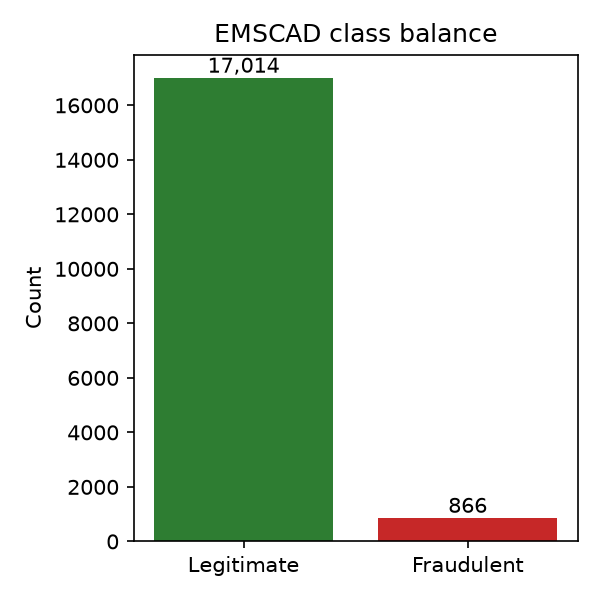
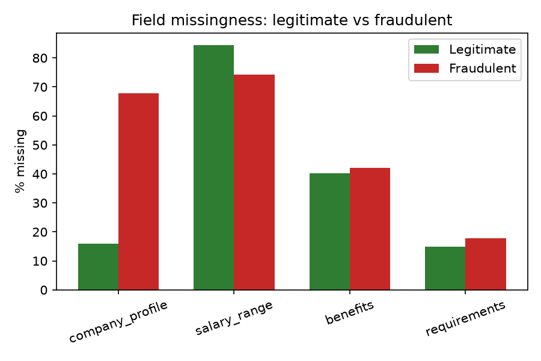
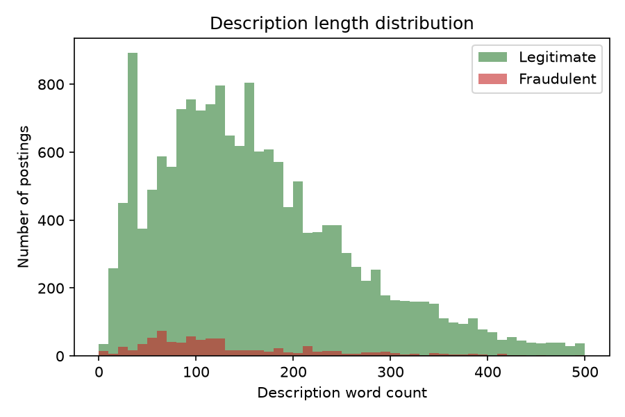

# EMSCAD — Exploratory Data Analysis

Generated from `ai_service/dataset/fake_job_postings.csv` (17,880 rows, 18 columns).

## Class balance

- Legitimate: 17,014
- Fraudulent: 866 (4.84%)

**Implication**: severe class imbalance (~5% positive class). Training (Phase 4) applies class-weighted loss so the classifier does not collapse to always predicting 'legitimate' — a naive 95%-accuracy model that never flags fraud would fail the project's actual goal.

## Duplicates

- Full-row duplicates: 0
- Title+description duplicates: 2093

## Missingness (top 10 fields)

| Field | Missing count | Missing % |
|---|---|---|
| salary_range | 15012 | 83.96% |
| department | 11553 | 64.61% |
| required_education | 8105 | 45.33% |
| benefits | 7220 | 40.38% |
| required_experience | 7050 | 39.43% |
| function | 6455 | 36.1% |
| industry | 4903 | 27.42% |
| employment_type | 3471 | 19.41% |
| company_profile | 3308 | 18.5% |
| requirements | 2698 | 15.09% |

## Missingness by class (fraud signal validation)

This directly validates the SRS Section 7.1/7.3 rule weights — fields the Trust/Severity engines penalize for being absent really are missing far more often in fraudulent postings than legitimate ones:

| Field | Missing % (legitimate) | Missing % (fraudulent) |
|---|---|---|
| company_profile | 15.99% | 67.78% |
| salary_range | 84.45% | 74.25% |
| benefits | 40.3% | 42.03% |
| requirements | 14.95% | 17.78% |

## Description length

